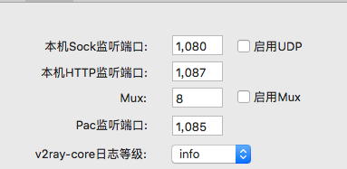

## node-instagram
> node 获取ins图片(自己的)
### ins-access_token 生成
  [一键生成](https://instagram.pixelunion.net/)
### 开启代理
  推荐使用代理, index.js中proxy填写代理的端口(默认应该是1080), 最好看下。
  
### 启动
  ```js
    node index.js
  ```  